<p align="center">
  
</p>

<p align="center">
  <samp>PERSONAL INDEX · WUHAN / 2026 · SIGNAL ONLINE</samp>
</p>

<h1 align="center">Computing is my medium.</h1>

<p align="center">
  Not a résumé wearing a nice skin.<br />
  A personal exhibition made from glass, water, type, sound, sport, and code.
</p>

<p align="center">
  <a href="#side-a">THE PERSON</a>
  &nbsp;·&nbsp;
  <a href="#side-b">THE EXPERIENCES</a>
  &nbsp;·&nbsp;
  <a href="#signal-chain">SIGNAL CHAIN</a>
  &nbsp;·&nbsp;
  <a href="#run">RUN LOCALLY</a>
</p>

<br />

<a id="side-a"></a>

## SIDE A / THE PERSON

I am **GGG Cheese** — **Akihisa** elsewhere — a Computer Science student at **Wuhan University** and a full-stack developer working in Wuhan, China.

I like software most when it stops feeling like software: when a drag has weight, light bends around an interface, a record remembers where it was playing, or a collection becomes a small world worth wandering through.

> Computing is more than engineering to me. It is material — something I can give shape, sound, friction, and memory.

| `01 / ON REPEAT` | `02 / ON THE SHELF` | `03 / BEYOND THE SCREEN` |
| :--- | :--- | :--- |
| Kanye West / Asen | Wang Xiaobo | Art / Sport |

<br />

<a id="side-b"></a>

## SIDE B / THE EXPERIENCES

One identity, interpreted through several visual systems. Every portal is a different answer to the same question: **what should a personal website feel like?**

| INDEX | PORTAL | MATERIAL / MOTION |
| :---: | --- | --- |
| `00` | **`/` — Glass Index** | A refractive homepage driven by water, light, spatial motion, and custom trackball physics. |
| `01` | **`/profile/minimal` — Glass / Quiet** | Restrained typography, generous space, and an editorial reading rhythm. |
| `02` | **`/profile/avant-garde` — Future / Expressive** | A louder field for motion, composition, and art-direction experiments. |
| `03` | **`/profile/ascii` — Chromatic / Generative** | Canvas, playable typography, and a profile translated into living ASCII. |
| `04` | **`/music` — Vinyl Study** | Tactile records, route-persistent playback, sleeve art, and a working tonearm. |
| `05` | **`/cards` — Player Archive** | A 55-card NBA, NFL, and football collection with layered prismatic optics. |

<br />

<a id="signal-chain"></a>

## SIGNAL CHAIN

```text
INPUT                 SYSTEM                         OUTPUT
pointer / touch  ───▶ trackball + quaternion  ────▶ water / glass / light
audio state      ───▶ persistent playback     ────▶ vinyl / tonearm / memory
card data        ───▶ masks + layered optics  ────▶ prismatic archive
shared identity  ───▶ visual style registry   ────▶ three profile languages
```

<p align="center">
  <samp>NEXT.JS 16 · REACT 19 · TYPESCRIPT 6 · THREE.JS · R3F · GSAP · MOTION · CSS MODULES</samp>
</p>

<br />

<details>
<summary><strong>OPEN THE TECHNICAL SLEEVE</strong> &nbsp;—&nbsp; architecture, controls, and workshop notes</summary>

<br />

### Design rules

- **The interaction must carry meaning.** Motion communicates weight, state, hierarchy, or navigation; it is not surface decoration.
- **One source, many interpretations.** Personal facts live in `data/profileData.ts`; visual directions are registered in `data/stylesConfig.ts`.
- **The fallback still deserves art direction.** Keyboard navigation, responsive layouts, and reduced-motion behavior are treated as part of the design.
- **Collections should feel authored.** Music and card data become tactile experiences instead of generic grids.

### Project map

```text
app/                  routes, layouts, and metadata
components/home/      lens, water field, navigation, corner portals
components/profiles/  minimal, avant-garde, and ASCII interpretations
components/music/     playback state, vinyl collection, turntable UI
components/cards/     archive, masks, foil, and optical effects
data/                 shared identity and collection catalogues
lib/                  interaction physics and common utilities
public/media/         record art, audio studies, and player cards
```

### Workshop controls

| COMMAND | USE |
| --- | --- |
| `npm run dev` | Start the local studio. |
| `npm run build` | Produce the release build. |
| `npm run lint` | Check the code surface. |
| `npm run typecheck` | Verify TypeScript without emitting files. |
| `npm run cards:validate` | Audit the generated card archive. |
| `npm run cards:rebuild` | Rebuild card assets and derived optics. |

</details>

<br />

<a id="run"></a>

## RUN THE EXHIBITION

Requires **Node.js 20.9+** and npm.

```bash
git clone https://github.com/gggchang4/GGG.git
cd GGG
npm install
npm run dev
```

Then enter [localhost:3000](http://localhost:3000).

<br />

## FIELD NOTES / PROVENANCE

The record-player previews use public-domain / CC0 music from [FreePD](https://en.freepd.cn/music). They are sound studies for the interface, not recordings from the commercial albums represented by the sleeve artwork.

Player-card sources and archive decisions are documented in [ATTRIBUTION.md](./public/media/cards/ATTRIBUTION.md) and [ARCHIVE.md](./public/media/cards/ARCHIVE.md).

This is a personal profile and an ongoing creative-coding laboratory, not a general-purpose portfolio template. Explore the implementation freely; please do not present the identity, writing, or media collection as your own.

<br />

<p align="center">
  <samp>
    GGG CHEESE / AKIHISA<br />
    COMPUTER SCIENCE · CREATIVE CODING · INTERACTION DESIGN<br />
    WUHAN, CHINA · STILL EXPERIMENTING
  </samp>
</p>

<p align="center">
  <a href="https://github.com/gggchang4"><strong>GITHUB / @GGGCHANG4 ↗</strong></a>
</p>

<p align="center"><sub>Built as a profile. Kept as a laboratory.</sub></p>
