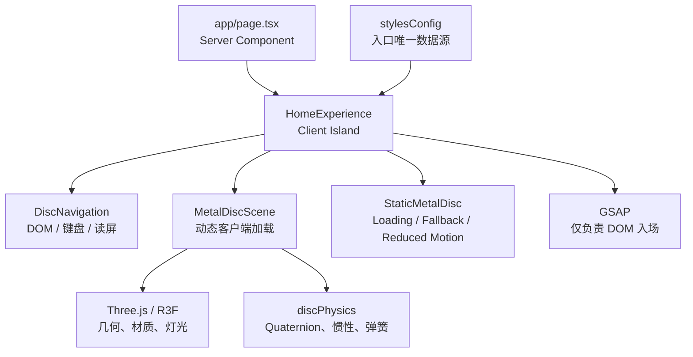

# ProfileWeb 架构审计

> 审计日期：2026-07-26  
> 当前阶段：Home Page 交互原型已完成，Profile 页面仍为占位骨架

## 1. 总体结论

项目已经具备可继续扩展的工程骨架，不需要重新初始化：

- Next.js App Router、React、TypeScript strict 与 Tailwind CSS 4 已正确接通。
- GSAP、Three.js、React Three Fiber 已进入 Home Page 的实际运行链路。
- Motion、Lenis、shadcn 相关依赖已经安装，但当前版本没有为了“用库而用库”。
- 多风格入口继续由 `data/stylesConfig.ts` 统一管理。
- Home Page 是独立 Client Island，其余布局、metadata、Profile 页面仍可保持 Server Component。
- `npm run lint`、独立 TypeScript 检查与 `npm run build` 均通过。

当前项目已经从“静态多风格卡片骨架”推进为“以 3D 交互作为核心记忆点的个人数字展厅入口”，但完整 Profile 内容、自动化测试、视觉回归和发布链路尚未完成。

## 2. 技术栈与接入状态

| 能力 | 版本 | 当前状态 | 用途 |
| --- | --- | --- | --- |
| Next.js | 16.2.6 | 已接入 | App Router、静态预渲染、metadata |
| React | 19.2.6 | 已接入 | UI 与 Client Island |
| TypeScript | 6.0.3 | 已接入 | strict 类型检查 |
| Tailwind CSS | 4.3.0 | 已接入 | 通用布局、原有 Profile 页面 |
| CSS Modules | Next 内建 | 已接入 | Home Page 复杂视觉、响应式与降级样式 |
| GSAP | 3.15.0 | 已接入 | Home Page 首次入场时间线 |
| Three.js | 0.184.0 | 已接入 | PBR 金属材质、环境反射、四元数物理 |
| React Three Fiber | 9.6.1 | 已接入 | React 内的 WebGL 场景 |
| Motion | 12.40.0 | 已安装，暂缓 | 后续页面转场与布局动效 |
| Lenis | 1.3.23 | 已安装，暂缓 | 后续长页面滚动叙事；单屏首页不需要 |
| shadcn / Base UI / Radix | 已安装 | 基础配置存在 | 后续 Profile 页面组件；当前无活跃 UI 组件 |

Tailwind v4 使用 `@tailwindcss/postcss` 与 `@import "tailwindcss"`，没有 `tailwind.config.*` 属于正常配置。

## 3. 当前目录职责

```txt
app/
├── layout.tsx                       全站 metadata、字体与根布局
├── page.tsx                         Home Page 服务端入口
└── profile/
    ├── classic/page.tsx             Classic 占位页
    └── experimental/page.tsx        Experimental 占位页

components/
├── common/                          Profile 页面通用壳与基础组件
├── home/
│   ├── HomeExperience.tsx           首页构图、手势与 GSAP 入场
│   ├── MetalDiscScene.tsx           R3F 场景、材质、灯光
│   ├── DiscNavigation.tsx           圆盘 DOM 语义入口
│   ├── StaticMetalDisc.tsx          加载、降级与 reduced-motion 圆盘
│   └── home.module.css              首页视觉与响应式
└── profiles/                        多风格 Profile 页面骨架

data/
├── stylesConfig.ts                  Profile 风格入口唯一注册表
└── profileData.ts                   多风格共享个人内容

lib/
├── discPhysics.ts                   轨迹球映射、角速度、弹簧复位
└── utils.ts                         className 合并

scripts/
└── project.ps1                      本地开发服务启动、停止与状态管理

docs/
├── ARCHITECTURE.md                  本文档
└── PRD.md                           产品需求与验收标准

TODO.md                              项目进度与想法池
archive/                             被 TS/ESLint 排除的历史参考
```

根目录 `assets/` 与 `public/` 都存在空资源目录。浏览器需要直接访问的字体、图片、模型应统一放入 `public/`；`assets/` 后续可删除或仅保留源文件，避免语义重复。

## 4. 运行时架构



### 关键边界

1. Three.js 是圆盘姿态的唯一所有者，GSAP 不写入圆盘的 3D transform。
2. Profile 入口文字使用真实 DOM；Canvas 只承担视觉表现。
3. WebGL 代码通过动态导入进入客户端，避免服务端 hydration 问题。
4. `frameloop="demand"` 让圆盘静止后停止持续渲染。
5. Canvas DPR 上限为 1.5，避免高分屏上无意义的 GPU 压力。
6. 静态 CSS 圆盘承担加载、WebGL 异常边界与 reduced-motion 模式。

## 5. 路由与数据契约

当前可构建路由：

```txt
/
/profile/classic
/profile/experimental
```

`stylesConfig` 使用判别联合：

- `status: "available"` 时，`route` 必须是字符串。
- `status: "placeholder" | "coming-soon"` 时，`route` 必须为 `null`。

因此当前首页的三个入口全部可以安全展示为 Reserved，不会产生 `href="#"`、空链接或 404。将来启用某个 Profile 时，只需修改配置，不需要改圆盘组件。

## 6. 交互实现

圆盘不是普通的 `rotateX/rotateY` 卡片倾斜：

1. Pointer 坐标被投影到虚拟轨迹球。
2. 相邻采样点通过 `Quaternion.setFromUnitVectors` 形成增量旋转。
3. 拖拽末端采样三维角速度，并限制极端甩动。
4. 松手后先保留惯性，再由二阶阻尼弹簧拉回初始四元数。
5. `pointer capture` 保证指针移出圆盘后仍可继续拖动。
6. 方向键可以短暂旋转，`Escape` / `Home` 触发复位。
7. `blur`、`pointercancel`、lost capture 都会安全结束手势。

## 7. 已验证项目

```txt
npm run lint
npx tsc --noEmit --incremental false
npm run build
npm run dev:start
npm run dev:status
npm run dev:stop
```

结果均通过。生产构建输出 4 个静态页面（含 Next 的 `_not-found`）；开发服务管理脚本已验证启动、HTTP 200、日志读取和安全停止流程。

尚未完成：

- 浏览器视觉截图验收。
- 真实设备触摸与触控笔验收。
- Safari / iOS WebGL 验收。
- FPS、内存和 Lighthouse 基准。
- 自动化 E2E 与视觉回归。

## 8. 风险与技术债

### P0：依赖安全

`npm audit --omit=dev` 当前报告 12 项：

- 7 high
- 3 moderate
- 2 low
- 0 critical

直接依赖涉及 `next` 与 `shadcn`，其余包含 PostCSS、Sharp 等传递依赖。应单独建立升级分支评估，不使用 `npm audit fix --force` 直接覆盖当前依赖树。

### P1：质量保障

- 没有 unit / integration / E2E 测试。
- 没有 CI、视觉回归、性能预算。
- WebGL context lost 目前依赖错误边界与静态降级，尚无主动恢复流程。

### P1：产品内容

- `profileData.ts` 仍是 `Your Name`、`hello@example.com` 等占位内容。
- Classic 与 Experimental 目前只有壳层差异，不是成熟的独立视觉系统。
- Editorial 尚无路由页面。

### P1：依赖治理

- Motion、Lenis、Base UI、Radix、CVA、tw-animate-css 当前未使用。
- `shadcn` CLI 通常更适合作为开发依赖，后续升级时应重新评估。
- `package.json` 尚未声明 `packageManager` 与 `engines`，团队环境可能漂移。

### P2：通用组件

- 旧 `StyleSelector` / `StyleCard` 已不再由首页使用，可在下次整理时归档。
- `Button` 同时模拟 Link 与 Button，类型模型可进一步拆分。
- Profile 页 Navbar 在小屏直接隐藏，没有移动端替代。

## 9. 架构原则

- 一个页面只保留一个视觉主张。
- 视觉系统与共享 Profile 内容分离。
- 动效引擎各自拥有明确职责。
- 功能性文字不只存在于 Canvas。
- 重效果必须有 reduced-motion、静态降级和性能上限。
- 新 Profile 通过配置注册，不在首页硬编码路由。
